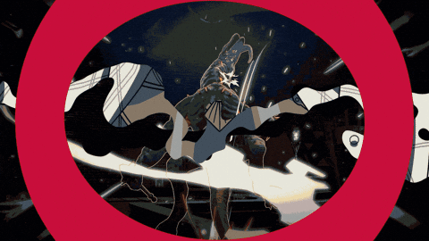
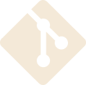
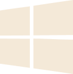
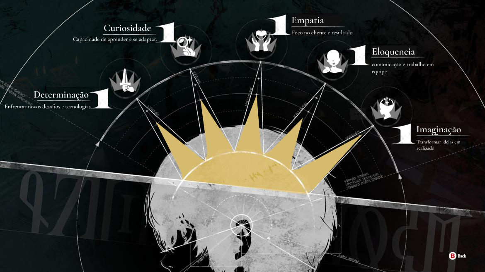
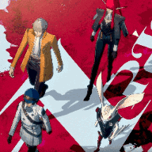

<!--  -->
 
 

 
 
<!-- 
<strong>Amanda Debussy,</strong> conhecida como <strong> "Mandy"</strong> ou <strong>"Mandyoca".</strong>  -->
 
 

⚔️ Analista de Sistemas pela universidade UNINTER  
 

⚔️ Trabalho com suporte ao usuário e Infra, porem faço pixel art tambem

⚔️ Paixao por aprender algo novo e aprimorar meus "arquétipos" 

⚔️ Atualmente aprendendo cloud, infraesturura ,back end e aprimorando técnicas 

 
<h2> 🛡️ Conhecimentos que venho adquirindo ao longo da minha jornada 🛡️</h2>

<h3 align="left">🚀 Frontend</h3>

  
  
  
  
  
  
  
  

---

<h3 align="left">🎨 Design</h3>

  
  
  

---

<h3 align="left">⚙️ Backend & Database</h3>

  
  
  
  

---

<h3 align="Left">☁️ DevOps & Tools</h3>

  
  
  
  
  
  
  
  
  

---

 
<h2> 🛡️ Virtudes Desenvolvidas 🛡️</h2>

<!-- <h3> 📖 Toda jornada começa com um sonho, mas apenas a determinação transforma sonhos em realidade.</h3>
 -->

<!-- 

  💌  ⤵️

  
  
  
  
  

 -->
